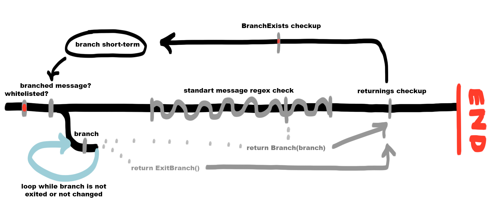

### Применение бранчей

Бранчи - удобная и быстрая short-term замена FSM, это цепи событий.

Каждый бранч - одна нить в этой самой цепи, на **одного пользователя (или чат)** может существовать только один бранч, при добавлении нового - бранч замещается, то есть переходит на другую схему

Рассмотрим следующую схему:



Обработка происходит слева направо. Сначала встречается Whitelist Checkup, если он не пройден эмуляция заканчивается прямо здесь. Далее эмулятор спрашивает у бранч-генератора, не является ли текущая "сессия" пользователя или чата, так называемой **BRANCHED**

Если сессия находится в бранче, дальнейшая проверка на сообщение не производится, проверка будет осуществляться только тем бранчем, который владеет сессией, то есть пока бранч не сменится или не будет сменен другим, его хендлер будет заведовать всеми сообщениями, пришедшими под этой сессией

**То есть, пока сессия бранча не будет закончена или передана другому бранчу, один и тот же хендлер будет обрабатываться при каждом новом сообщении от этого источника**

### Синтаксис

Для того чтобы нормально работать с бранчами вам понадобится импортировать 2 класса из VKBottle: **Branch** и **ExitBranch**

Все эти два класса работают только при возвращении их из хендлера сообщения

| Branch     | При возвращении из хендлера добавляет текущий источник в branch short-term в сочетании с переданным аргументов - названием бранча для перехода. Так же можно передать kwargs бранча которые будут возвращены в его хендлер |
|:----------:|:--------------------------------------------------------------------------------------------------------------------------------------------------------------------------------------------------------------------------:|
| ExitBranch | Нужен для того чтобы выйты из любого разветвления событий к начальной точке, то есть убирает текущий источник из branch short-term. Можно передать как инициированный экземпляр так и нет                                  |

Рассмотрим для примера простой хендлер который вводит пользователя в бранч:

```python
@bot.on.message('хочу в бранч', lower=True)
async def wrapper(ans: Message):
    await ans('Теперь ты в бранче')
    return Branch('my_branch')
```

Хендлер обозначает что теперь источник который написал сообщение "хочу в бранч" принадлежит бранчу с названием "my_branch". Давайте создадим бранч с таким именем:

```python
@bot.branch.simple_branch('my_branch')
async def branch(ans: Message):
    if ans.text.lower() == 'выйти':
        await ans('Ок, вывожу')
        return ExitBranch()
    await ans('Ты в бранче. Пиши выйти чтобы выйти отсюда')
```

Теперь после написания сообщения "хочу в бранч", любое сообщение пользователя получит ответ "Ты в бранче. Пиши выйти чтобы выйти отсюда". Но если пользователь напишет выйти, то цепочка разорвется

### Kwargs'ы в бранчах

При инициации бранча можно так же передать некоторые необходимые значения, которые позже будут переданы и в хендлер бранча

```python
@bot.on.message('ставлю боту <mark:int>', lower=True)
async def wrapper(ans: Message, mark):
    await ans('Теперь расскажи что ты думаешь о нем')
    return Branch('my_branch', mark=mark)

@bot.branch.simple_branch('my_branch')
async def branch(ans: Message, mark):
    if ans.text.lower() in ['это все', 'да']:
        await ans(f'Ок, твоя оценка {mark} и рассказ о боте зачитан')
        return ExitBranch()
    await ans(f'Ты считаешь что <<{ans.text}>>. Мы тебя поняли. Это все?')
    return Branch('my_branch', mark=mark)
```

Теперь бот будет получать оценку пользователя из обычного хендлера и передавать его в сам бранч

Пока это все
