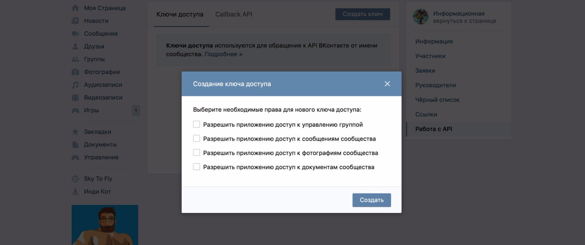

# Некоторые ответы на часто задаваемые вопросы


## Asyncio

В этом разделе будет очень сжатое и простое описание работы с модулем **asyncio** и простые рекомендации как решать проблемы с блокировками.

# Что такое coroutine?

Coroutine это функция (сопрограмма), которая должна вызываться через **await**. 

Когда в Python выполнeние кода доходит до **await**, он останавливает выполнение в этой функции, и вернётся к ней, пока 
не выполнит другие сопрограммы и не завершит работу этой функции.

Благодаря такому подходу, программа может выполнять конкурентно несколько задач одновременно без использования потоков, 
а следовательно, будет экономия ресурсов железа и высокая производительность.


### Не забывайте перед async функцией писать вначале await, иначе она не запустится.

```python
import asyncio


async def get_banana() -> str: return "banana"


async def main():
    print(get_banana())  # <coroutine object get_banana at 0x...>
    print(await get_banana())  # banana


asyncio.run(main())
```

## Где надо писать **await** ?

Надо **await** писать только внутри **async** функций и больше нигде.

```python
# bad
async def foo() -> str: return "foo"


def main():
    print(await foo()) # SyntaxError: 'await' outside async function

    
main()
```
```python
# bad
async def main():
    print("main")
    
    
await main()  # SyntaxError: 'await' outside function
```
```python
# good
import asyncio

async def foo() -> str: return "foo"


async def main():
    print(await foo())


asyncio.run(main())
```

## Как происходит "блокировка" функции?

В асинхронном программировании блокирующие функции это все функции без конструкции **await**, работающие на принципе
IO [(Input/Output)](https://en.wikipedia.org/wiki/Input/output). 

Но не все блокирующие функции плохи, так как их использование неизбежно. Главное, этим не злоупотреблять. 
Если заблокируете выполнение функции надолго, то ваш бот зависнет, 
потому что он не остановил функцию в нужный момент, чтобы выполнять другие сопрограммы.

Конечно, Python не запрещает использовать синхронные решения в программировании асинхронных, но в этом нет смысла,
так как пропадают все преимущества асинхрона. 

Самые частые проблемы блокировок происходят из-за функций то типу `time.sleep()`.
В **async** функциях используйте `asyncio.sleep()`.

```python
# bad
time.sleep(10)
```

```python
# good
await asyncio.sleep(10)
```

Так же распространённой проблемой долгой блокировки является модуль **requests**, **urllib3** 
и ему производные API-обёртки (**vk_api**, и тп). 

Они хороши для **неасинхронного** программирования, но могут произойти ситуации, когда запрос-ответ может идти
долго и бот из за этого зависнет. Используйте для этого модуль 
[aiohttp](https://docs.aiohttp.org/en/stable/client_quickstart.html), 
он идёт "из коробки" с vkbottle или используйте встроенный AiohttpClient.

```python
# bad
async def send_httpbin_get() -> dict:
    r = requests.get('http://httpbin.org/get')
    if r.status_code == 200:
        js = r.json()
        return js
```

```python
# good, recommended
# see https://vkbottle.readthedocs.io/ru/latest/low-level/http/http-client/
from vkbottle.http import AiohttpClient

async def send_httpbin_get() -> dict:
    http_client = AiohttpClient()
    return await http_client.request_json('http://httpbin.org/get')
```
```python
# good
import aiohttp


async def send_httpbin_get() -> dict:
    async with aiohttp.ClientSession() as session:
        async with session.get('http://httpbin.org/get') as r:
            if r.status == 200:
                js = await r.json()
                return js
```
## Почему так мало базы? Ничего не понятно

В Python написание async кода требует такого же освоения и понимания, как и других синтаксических конструкций.


Подробнее о работе с asyncio читайте в [официальной документации.](https://docs.python.org/3/library/asyncio.html)

Дополнительные материалы помимо официальной документации:
* [В форме текста](https://www.google.com/search?q=python+asyncio)
* [В форме текста, на русском](https://www.google.com/search?q=python+asyncio+lang%3Aru)
* [В форме плейлистов с видео](https://www.youtube.com/results?search_query=python+asyncio&sp=EgIQAw%253D%253D)

## Какие методы присутствуют во фреймворке

Всё что есть в [официальной документации от vk.com](https://dev.vk.com/reference).

Синтаксис методов, параметры и ошибки аналогичны документации выше, 
только методы пишутся в **snake_case**, а не **camelCase**.

```python
from vkbottle.api import API

api = API("token")

# https://api.vk.com/method/account.unban
await api.account.unban(owner_id=1)


# https://api.vk.com/method/account.getBanned
await api.account.get_banned(offset=0, count=1)
```

Все официальные методы, ответы и ошибки в этом фреймворке **типизированы**. 
Чтобы не гадать, перебирать и постоянно заглядывать в документацию, поставьте [настоящий редактор кода](recommended_ide.md), 
чтобы он давал подсказки.

А также настоятельно рекомендуется по ходу написания кода использовать 
[тайпхинты](https://docs.python.org/3/library/typing.html), 
чтобы облегчить себе жизнь и увеличить скорость написания и отладки кода.


## Как получить токен для пользователя

Самый простой способ воспользоваться сервисом [vkhost.github.io](https://vkhost.github.io)

## Как получить токен для бота
[Чат бот Быстрый старт](https://dev.vk.com/api/bots/getting-started)

## Как отправить метод, которого нет во фреймворке

Если очень нужно использовать то, чего во фреймворке и официальной документации нет, 
используйте `API.request` или `bot.api.request` методы. 

После их выполнения вернёт словарь, а не типизированный объект, учитывайте это.

Userbot:
```python
# userbot
import asyncio

from vkbottle.api import API

api = API("token")


async def main():
    await api.request("users.get", {})  # Single request

    # Multiple request for one session
    async for response in api.request_many(
        [api.APIRequest("users.get", {}), api.APIRequest("groups.get", {})]
    ):
        print(response)


loop = asyncio.get_event_loop()
loop.run_until_complete(main())
```

У бота не все методы доступны в отличие от Userbot, учитывайте это.

Bot:
```python
import asyncio
from vkbottle.bot import Bot, Message

bot = Bot("token")

async def main():
    print(await bot.api.request("users.get", {}))  # Single request

    # Multiple request for one session
    async for response in bot.api.request_many(
        [bot.api.APIRequest("users.get", {}), bot.api.APIRequest("groups.get", {})]
    ):
        print(response)


loop = asyncio.get_event_loop()
loop.run_until_complete(main())
```

## Pydantic.error_wrappers.ValidationError

Объекты в этом фреймворке типизированы и генерируются на основе 
[официальной VK-API схемы](https://github.com/VKCOM/vk-api-schema).

Они её обновляют без предупреждений и из-за этого могут произойти поломки с валидацией объектов.

Если эта ошибка произошла, попробуйте обновить типы:
```shell
pip install git+https://github.com/vkbottle/types -U
```

Если и это не помогло, пишите issue (в vkbottle, __не types__) или в чат ВК/Телеграмм.
