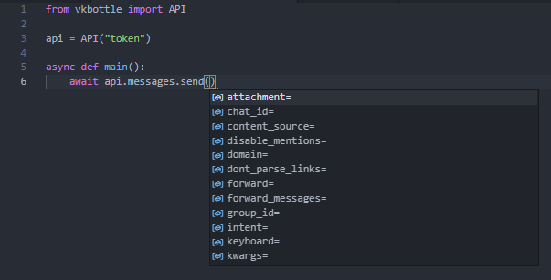

# Первый бот на vkbottle

Добро пожаловать в первую часть туториала, здесь будет представлено как можно взаимодействовать с `API` и рассказано почему нужно использовать только асинхронные библиотеки при работе с `vkbottle`

Для начала работы с апи следует импортировать нужный объект - `vkbottle.API`

```python
from vkbottle import API
```

`API` - готовый инструмент для того, чтобы делать запросы к апи вконтакте, приятная особенность этого инструмента в vkbottle - полная типизация ([vkbottle-types](https://github.com/vkbottle/types)). Что дает эта типизация?

## Типизация

При условии, что у вас стоит [нормальное IDE](recommended-ide.md) вы можете использовать подсказки типов:



Это значительно ускорит скорость разработки и позволит не обращаться в документацию api вконтакте каждый раз

Как уже стало понятно из картинки выше, для вызова метода используется ключевое слово `await`, которое является частью реализации асинхронности python, перед продолжением чтения туториала рекомендуется [почитать официальную документацию](https://docs.python.org/3/library/asyncio.html), если вы этого не делали

## Первый запрос

Для того чтобы инициализировать `API` вам понадобится строка (токен) или вы можете использовать лист строк (токенов), которые автоматически конвертируются в специальный [token-generator](../low-level/api/token-generator.md)

Обернем наш будущий запрос базовым способом исполнения асинхронного кода:

```python
import asyncio

async def main():
    ...

asyncio.run(main())
```

Теперь напишем само взаимодействие:

```python
api = API("token")
await api.wall.post(message="#vkbottle прекрасен!")
```

Такой запрос создаст пост на стене группы/пользователя с указанным текстом, как вы видите параметры запроса принимаются в качестве аргументов (IDE вам все подскажет)

Вот, что должно получиться в итоге:

```python
import asyncio
from vkbottle import API

async def main():
    api = API("token")
    await api.wall.post(message="#vkbottle прекрасен!")

asyncio.run(main())
```

Поздравляю, теперь вы умеете работать с инструментом `API`!

## Первый бот

!!! info "Примечание"
    Если вы не хотите использовать простые (high-level) инструменты для разработки бота вы можете использовать low-level [Polling](../low-level/polling/polling.md), или самостоятельно написать всю логику на запросах к api как показано в разделе выше

Чтобы начать работу с ботом, требуется импортировать класс `Bot` из корня проекта (`vkbottle.Bot`) или из специализированного пакета (`vkbottle.bot.Bot`):

!!! warning "Внимание"
    Bot - это бот исключительно для группы, если вы хотите юзербота, то сначала ознакомьтесь с [этим](../high-level/user/user.md).

```python
from vkbottle.bot import Bot
```

Для инициализации бота обязателен аргумент - `token` *или* `api`. `token` нужен для сокращения кода: если вы передадите `token`, будет создан `API` с соответствующим генератором токена. Если вы передадите `api`, он и будет использоваться для бота

```python
# Инициализация токеном
bot = Bot(token="token")
# (или) Инициализация с апи
bot = Bot(api=api)
```

Теперь вы можете добавить нужные хендлеры, за удобное добавление хендлеров отвечает элемент [labeler](../high-level/bot/labeler.md), к которому вы можете обратиться через `bot.labeler` или `bot.on` (`.on` нужен просто для красоты и для традиционного legacy вкботла из второй версии)

```python
from vkbottle.bot import Bot, Message

bot = Bot(token="token")

@bot.on.message(text="Привет")
async def hi_handler(message: Message):
    users_info = await bot.api.users.get(message.from_id)
    await message.answer("Привет, {}".format(users_info[0].first_name))

bot.run_forever()
```

Разберем новый код построчно:

`@bot.on.message(text="Привет")` - это декоратор, он означает, что если сообщение будет отвечать заданным правилам (`text="привет"`), сработает хендлер под декоратором

Для сообщений в vkbottle существует 3 декоратора:

`.message` - обрабатывает сообщения и из бесед и из личных переписок

`.private_message` - обрабатывает сообщения только из личных переписок

`.chat_message` - обрабатывает сообщения только из бесед

`async def hi_handler(message: Message)` - объявление хендлера, `hi_handler` - название функции, может быть разумно любым, `message` - аргумент, который обязательно вернется в хендлер, нужный для получения информации о событии

`users_info = await bot.api.users.get(message.from_id)` - запрос к API, получение информации о пользователе, написавшем сообщение

`await message.answer("Привет, {}".format(users_info[0].first_name))` - отправка сообщения в чат с пользователем, `answer` - удобный шорткат для ответа на сообщения, аргументы идентичны методу `messages.send`, но шорткат не требует id чата и `random_id`

`bot.run_forever()` - помогает асинхронно запустить бота из синхронной среды, если бы была создана асинхронная, вы бы могли использовать `await run_polling()`

Если представленный код не работает, проверьте поставили ли вы галочки в настройках лонгпола на нужные события (в данном случае на новые сообщения) и сам лонгпол (стабильна версия `5.131`)

## Экзамплы по этой части туториала

* [easy-bot](https://github.com/vkbottle/vkbottle/tree/master/examples/high-level/easy_bot.py)
