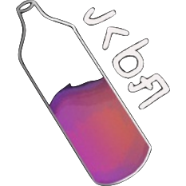

# Почему вы должны использовать vkbottle?

**VKBottle** — это фреймворк, созданный для комфортной и быстрой разработки высоконагруженных проектов, использующих VK API
<!-- markdownlint-disable-next-line -->
<figure markdown>
  
</figure>

Нужно работать с чистым API ВКонтакте, настроить HTTP-клиент или валидировать ответ сервера, отловить и обработать ошибку в рантайме? Да запросто: новая версия VKBottle позволит сделать это в несколько строк кода.

Работать с VK API ещё никогда не было так легко. И вот почему:

* Обновление получила система роутинга — теперь она работает в несколько раз быстрее и производительнее. Добавлено несколько новых интерфейсов — View и Labeler, которые помогут кастомизировать и улучшить обработку событий.
* Бранчи также получили большое обновление. Теперь это стейты — гибкая и удобная веточная система организации действий. Создавайте квизы, игры и интерактивные меню — возможности не ограничены.
Прочитайте документацию и попробуйте — <https://vkbottle.readthedocs.io/ru/latest/>

[Наш телеграм чат](https://t.me/vkbottle_ru)
